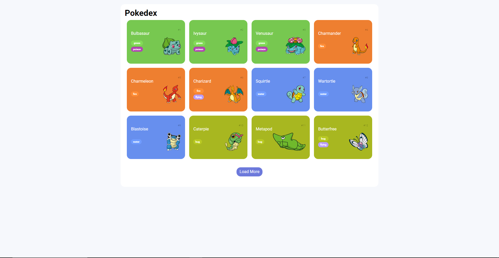
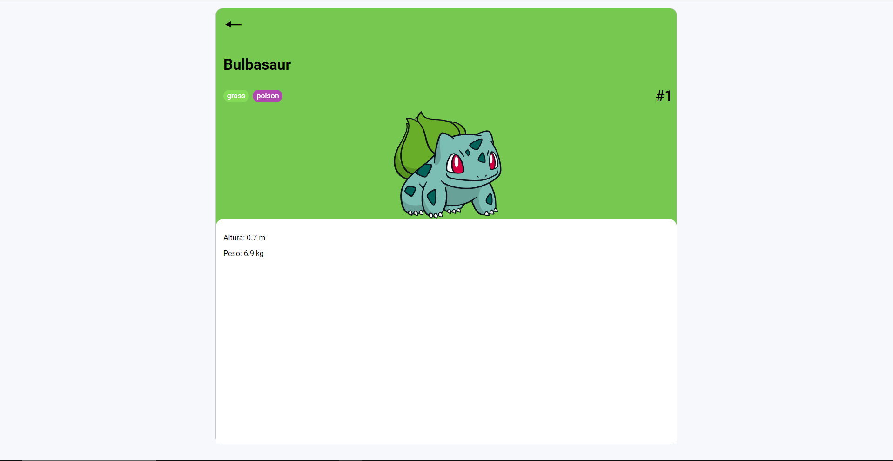

# pokeapi-Pokedex

## 📃 Descrição

Este projeto é uma Pokedex simples que exibe todos os Pokémon da primeira geração. A requisição dos dados é feita utilizando a **PokeAPI** através da `fetch` API no Javascript. O aplicativo apresenta uma lista com informações dos Pokémon, incluindo nome, número, tipo e imagem. Clicando nos pokemons será redirecionado para uma página de detalhes simples(A ser finalizada).

## 💻 Tecnologias utilizadas
* **HTML**

* **CSS**
    * `normalize CSS`
    * `Mobile First`
      
* **Javascript**
    * `fetch API`
      
* **Requisição HTTP**
    * `URL`
    * `Request Methods`
    * `Path Params`
    * `Query Strings`
    * `Request Headers`
    * `Request Body`
    * `Status Code`

## 🖼 Imagens do Site

## 📌 Mais Informações

Este projeto faz parte da trilha de JavaScript do bootcamp **Ri Happy - Front-end do Zero** da DIO(**Digital Innovation One**).

## 🔗 Links

- [Digital Innovation One](https://www.dio.me/)
- [PokeAPI](https://pokeapi.co)
- [Repositório base do projeto](https://github.com/digitalinnovationone/js-developer-pokedex)
